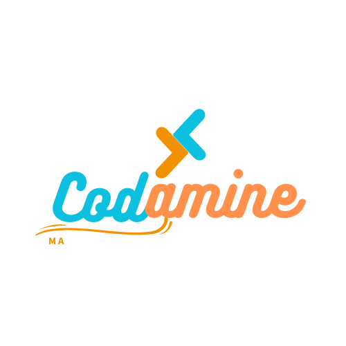

<p align="left">
  
</p>

# LOD Viewer with Three.js for 3D Visualization

This project demonstrates the implementation of a dynamic Level of Detail (LOD) system using Three.js. The system is designed to optimize rendering performance for complex 3D scenes by adjusting the detail of models based on their distance from the camera and their angle relative to the camera's view direction. This approach ensures a balance between visual fidelity and performance, especially in resource-intensive applications.

## Features

- Distance-Based LOD: Dynamically switches between different levels of detail based on the camera's proximity to objects.
- Angle-Based LOD: Further optimizes detail by reducing complexity for objects at steep angles to the camera's view direction.
- Smooth Camera Transitions: Utilizes Tween.js for fluid camera movements and focus changes.
- **Interactive GUI: Includes a customizable interface built with dat.GUI, allowing real-time control of:**
- Shadow toggling and intensity adjustments.
- Fog effects (color and density).
- Camera parameters (FOV, position, and far clipping).
- **Shadow and Fog Optimization: Dynamically adjusts shadow casting and fog settings for better visual quality and performance.**
- **Model Loading with GLTFLoader: Supports loading multiple LOD levels of models in .glb format.**

##Technologies Used

- Three.js: Core framework for 3D rendering.
- GLTFLoader: Efficiently loads GLTF/GLB models.
- Tween.js: Handles smooth animations for camera movements.
- dat.GUI: Provides an interactive interface for controlling scene settings.

#How It Works

1. LOD Setup: Models are pre-loaded with different levels of detail using the `THREE.LOD` class. Each level corresponds to a specific distance threshold.
2. Dynamic Updates:
   - Distance-based LOD: The system determines which LOD level to display based on the camera's distance to the object.
   - Angle-based LOD: Objects facing the camera retain higher detail, while those at steeper angles use lower-detail models.
3. User Interaction: Users can adjust scene settings via the GUI, including camera parameters, fog density, and shadow toggling.

#Setup Instructions

1. Clone the repository:

```bash
git clone https://github.com/KasemTec/LOD_Viewer.git
```

2. Install dependencies:

```bash
# three.js
npm install --save three

# vite
npm install --save-dev vite
```

3. Start the development server:

```bash
npx vite
```

4. Open `http://localhost:5173/` in browser

## Demo Video

<video width="640" height="360" controls>
  <source src="https://github.com/user-attachments/assets/06c9a1a4-2823-4fbc-8b12-6dd14a206f88" type="video/mp4">
 
</video>
